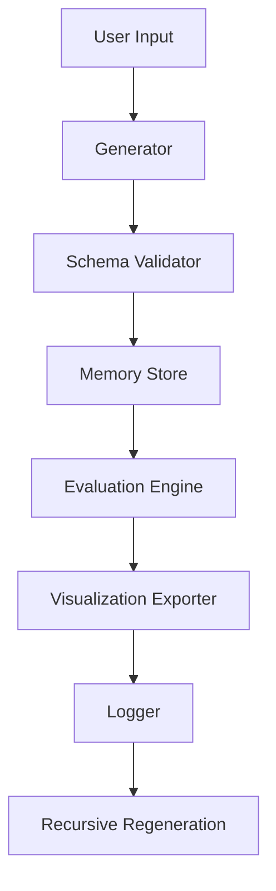

# Grimoire v4.5 — AI Instructional Workflow Generator

---

## Table of Contents
1. [Overview](#overview)
2. [Design Philosophy](#design-philosophy)
3. [System Architecture](#system-architecture)
4. [Core Features](#core-features)
5. [How It Works](#how-it-works)
6. [Example Templates](#example-templates)
7. [Operational Workflow](#operational-workflow)
8. [Intended Users](#intended-users)
9. [Technology Stack](#technology-stack)
10. [Setup & Usage](#setup--usage)
11. [Future Enhancements](#future-enhancements)
12. [Contributing](#contributing)
13. [License](#license)
14. [Contact](#contact)

---

# Overview

**Grimoire v4.5** is a **meta-educational AI system** designed to automatically create, evaluate, and evolve **instructional workflows**.  
It acts as both a *teacher* and a *scribe*, transforming user-defined purposes into self-contained learning frameworks that humans or AI systems can follow.

Each workflow functions as a **spell of knowledge**—a structured incantation of tasks, dependencies, and logic sequences—capable of recursively generating new forms of instruction.

---

# Design Philosophy

> “Each workflow teaches the next workflow how to teach.”

Drawing inspiration from **grimoires**—ancient books of magic containing rituals, invocations, and correspondences—this system encodes **instructional intelligence** into structured templates.  
Every generated workflow carries the potential to reproduce itself through recursive synthesis, forming a lineage of evolving pedagogical entities.

---

# System Architecture

| Component | Purpose | Description |
|------------|----------|-------------|
| **generator/** | Workflow synthesis engine | Converts abstract user intent into structured guides and templates |
| **ai_core/** | Orchestration nucleus | Controls recursive flow, dependencies, and regeneration |
| **ai_memory/** | Knowledge archive | Stores and retrieves generated workflows |
| **ai_validation/** | Schema guardian | Ensures structural integrity and completeness |
| **ai_evaluation/** | Reflective analysis | Grades clarity and internal coherence |
| **ai_visualization/** | Manifestation tools | Converts dependency data into graphs and diagrams |
| **ai_monitoring/** | Conscious oversight | Logs workflow generation and evolution events |
| **data/templates/** | Archetypal blueprints | Predefined structures for instructional genres |
| **docs/** | Meta documentation | Contains architectural and theoretical references |

---

# Core Features

* **Recursive Workflow Generation** — Each output can seed future workflows.
* **Bimodal Representation** — Produces Markdown (for humans) and JSON (for machines).
* **Schema-Driven Validation** — Ensures logical consistency across modules.
* **Persistent Memory System** — Archives and versions all outputs.
* **Self-Evaluative Feedback Loop** — Measures clarity and completeness.
* **Visual Export** — Renders dependency networks as Graphviz diagrams.
* **Structured Logging** — Tracks every generation event in `logs/workflow.log`.

---

# How It Works

1. **Invocation** — User defines the purpose, audience, and delivery mode.  
2. **Generation** — `generator/main.py` synthesizes the workflow structure.  
3. **Validation** — Schema verification ensures completeness and logic.  
4. **Evaluation** — Quality metrics measure clarity and instructional depth.  
5. **Reflection** — System logs and stores results for recursive evolution.  

This recursive design ensures every workflow is both *an artifact* and *an algorithm*—a blueprint for self-replicating knowledge.

---

# Example Templates

Grimoire v4.5 ships with archetypal templates stored in `data/templates/`:

| Template | Focus | Primary Use |
|-----------|--------|-------------|
| `training_curriculum_template.json` | Education | Build structured learning programs |
| `technical_procedure_template.json` | Engineering | Standardize technical or scientific procedures |
| `creative_writing_template.json` | Arts | Generate literary, poetic, or narrative workflows |
| `meta_reflection_template.json` | Metacognition | Evaluate and evolve cognitive frameworks |

Each template can be invoked and customized using CLI or direct module calls.

---

# Operational Workflow

# Intended Users
### AI Developers — 
To experiment with meta-educational systems.

### Educators & Trainers — 
To auto-generate curriculum structures.

### Writers & Designers — 
To design recursive creative frameworks.

### Research Institutions — 
To explore AI-guided pedagogical recursion.

# Technology Stack

### Python 3.10+

### JSON + Markdown Hybrid Architecture

### Graphviz (optional) for visualization

### pytest for validation testing

### Custom AI Reasoning Modules (future)

# Setup & Usage

### Clone the repository:

> git clone https://github.com/Tommy-Raven/AI_instructions_workflow.git

> cd AI_instructions_workflow

### Install dependencies:

> pip install -r requirements.txt

### Run the CLI:

> python cli.py --purpose "Design an AI ethics curriculum"

### View results

**Generated JSON** → *data/workflows/*

**Logs** → *logs/workflow.log*

***Optional*** **.dot graph** → *build/workflow_graph.dot*

## Future Enhancements

Adaptive self-learning loop using semantic embeddings

Domain-specific plugin grimoires (medical, mechanical, creative)

Multi-agent recursive co-generation

Interactive visual dashboard

Integration with open LLMs for semantic workflow synthesis

## Contributing

Contributions are welcome—especially around recursive orchestration, AI memory optimization, and multi-domain schema integration.

Open an issue or pull request via GitHub.

## License
Proprietary — In Research Phase. 
*see: LICENSE*

All rights reserved © 2025 Tommy Raven / Raven Recordings

## Contact

Author: Tommy Raven

Email: [GitHub Issues Preferred]

Project Codename: Grimoire v4.5

Repository: github.com/Tommy-Raven/AI_instructions_workflow
